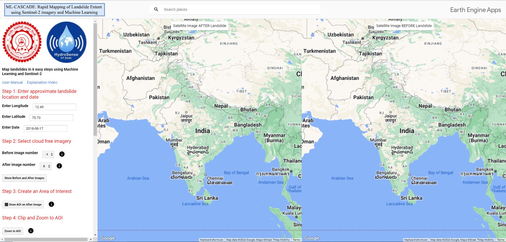

The ML-CASCADE application is a Machine Learning based landslide annotation app based on Google Earth Engine developed at HydroSense Lab at IIT-Delhi. ML-CASCADE provides an easy and fast way to annotate landslides using sentinel 2 data in Google Earth Engine. 
ML-CASCADE is published in Landslides journal and for in depth workings user may refer to the [research paper](https://link.springer.com/journal/10346)

  <figure>
    
  </figure>

Overview of ML-CASCADE

Disclaimer 
======
There are two versions of this app. The first one is an easy to use Google Earth Engine based app hosted as [GEE app](https://hydrosense.users.earthengine.app/view/ml-cascade). The usage of this app does not require any Google Earth Engine account, however the app uses getDownload Url which supports a maximum request size of 32MB and grid of 10000. 
Another version of this application can be developed using the code provided on GitHub. The code has to be copied in text editor of Google earth engine and on run will create the same interface like the ML-CASCADE app however the download button will be substituted to export to drive button. The export has to be done from GEE console, which will permit larger exports of billion+ pixels.  

App Usage and Overview 
======
ML-CASCADE is a web based app can be found at [ML-CASCADE](https://hydrosense.users.earthengine.app/view/ml-cascade). The computations are performed in cloud in real-time making the app fast to use. 
There are some prerequisites of running this app. \
1)	The landslide must be large enough so that sentinel 2 satellite can capture the spatial occurrence of landslide. \
2)	The user must have an idea of the location and the date when landslide happened. \
On visiting the ML-CASCADE homepage, you will see an interface as shown below.

  <figure>
    
  </figure>

Homepage of ML-CASCADE

The homepage will zoom into India and contain three panels. One control panel and two map panels. The control panel contains buttons and widgets for the user to interact with the app as well as maps. The map panels contain titles of Before Image and After Image. These are linked maps and a process done on one map is automatically shown on the second map (e.g. Zooming on one maps automatically zooms in the other map).    

The first line includes the link to this user manual and a [video](www.youtube.com) showcasing how to use ML-CASCADE. The usage of ML-CASCADE requires 6 steps which should be done sequentially. In case the user misses a step, it is requested that the user restart the app since the ML-CASCADE runs sequentially. Missing a step and going back will lead to unwanted behavior of the app.  

STEP 1: Location and Date  
======
The user is required to enter the approximate location of the area of interest and the date of landslide which can be acquired from various sources like news, social media or twitter.  The algorithm in the backend will search for all images that cover the area of interest and where the cloud fraction in the image is less than 30%. 

 
STEP 2: Load cloud free images  
======
Based on the user input the algorithm identifies Sentinel-2 images before landslide and after landslide images. The Sentinel-2 cloud masking algorithm designates areas identified as clouds with a NaN value. Nonetheless, it is important to note that Sentinel-2 cloud masking algorithm cannot fully capture all cloud coverage. Consequently, some clouds might still be present in the landslide-affected regions. Therefore, a visual inspection is required to ensure that these residual clouds are identified.
 To overcome this problem, we define before and after image selectors. The after-image selector should be increased by one step, and the before image selector should be decreased by one step until the user is able to find images where the landslide area is cloud free. After changing the before and after image number the user must click Show Before and After Images button to render images in Realtime 
  
STEP 3: Create an Area of Interest 
======
Once the before and after images are finalized the user needs to create a rectangular AOI by clicking on Draw AOI on After Image, which will change the cursor to + sign. The user then draws area on the map. The Geometry will copy over to before image. The user must make sure that there is no masked value in the before or the after image. In case of masked values, the annotation output will also be masked. In case inaccurate geometry is created, the user can create another rectangular geometry, although only most recent geometry will be saved and shown.
  
 
STEP 4: Zoom to AOI  
======
Once the geometry is finalized click on Zoom to AOI which clips both before and after images and zooms to the area selected with a rectangular boundary over the AOI on both before and after images. If the user is not happy with the boundary selection, the user must go to STEP 2 and reload before and after images and then repeat STEP 3 and STEP 4. 
  
Step 5: Create landslide and non-landslide sample points 
======
Once the AOI images are visible on the map we need to create landslide samples. To start creating landslide samples click 	   button which will start the point tool. The user then clicks on the after image on the points that are landslides. For optimum annotation the user must make sure that 
1) The landslide points are diverse and cover all the images. 
2) The difficult areas are marked adequately. 
Once appropriate samples are selected, the user should click on Create layer button to create landslide points layer, this will remove points from the map and save them as labels.
 
To add non landslide samples click     button which will start the point tool. The user then clicks on the after image on the points that are not landslides. For optimum annotation the user must make sure that areas which can be confused with landslides but are non-landslides should especially be marked. User must also make sure to consider the edge cases.  
Once appropriate samples are selected, the user should click on Create layer button to create non-landslide points layer, this will remove points from the map and save them as non-landslide points.
   
SNIC parameters (Optional) 
======
SNIC is an Object based non iterative algorithm that clusters similar pixels into objects. SNIC parameters can be used if check box is checked.  For mor info on SNIC  and its GEE implementation users can refer to [SNIC paper](https://openaccess.thecvf.com/content_cvpr_2017/papers/Achanta_Superpixels_and_Polygons_CVPR_2017_paper.pdf)and  [SNIC GEE Documentation](https://developers.google.com/earth-engine/apidocs/ee-algorithms-image-segmentation-snic)
  
Step 6: Label Generation  
======
On providing all the data points the map, the user needs to click Run Algorithm, which will trigger 
GEE to run Random Forest in the backend and create a classification layer. On clicking the Run Algorithm button, the map will go from a linked map to a single map with 6 layers. The Before landslide image, the after-landslide image, the landslide points provided by the user in red color, the non-landslide points in green color. The two new layers generated will be the Random Forest probability layer and a binary layer of landslides. 
  
Download the data 
======
Once all the results are satisfactory the user can download the images for further use and processing by clicking download. This will create two links to download the raw data as well as labels. In case the raw data is large only a link for label will be made available. If using the app version the Download will trigger an export to drive function. 
 
